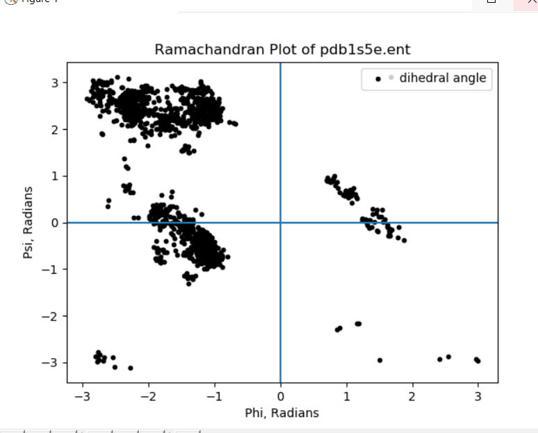
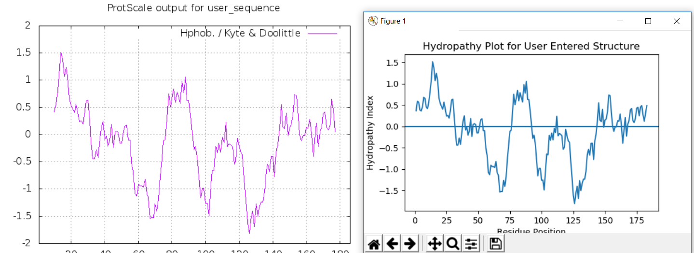

# Nyx
CLI Bioinformatics tool

### BioPy 
BioPy is a simple tool to obtain more information about a user-entered protein. It utilizes the RCSB PDB to fetch a .pdb file, and Biopython to analyze it. Currently, it supports several unique features, such as the building of a Ramachandran plot and the construction of a hydropathy plot, and can BLAST proteins from the command line.

#### Required: 
Matplotlib, numpy, and Biopython. "Nyx" is my own python file, and contains the values for the Kyte-Doolittle plot.

**Biopython** is an awesome bioinformatics tool. Read more about it [here.] This program uses Bio.PDB for structural bioinformatics, and only shows a small amount of what biopython can do. I strongly recommend checking it out. 

[here.]: https://biopython.org/wiki/Documentation

#### To install required packages: 
`pip install matplotlib numpy biopython`
#### To run:
With the python files in the same folder: `python BioPy.py`. That's it! From here, you can then obtain more information about a specific protein, provided that you know that four-character RCSB PDB code. 

#### The Ramachandran plot
A Ramachandran plot analyzes peptide backbone geometry, and gives insights into secondary structure, as a-helices and beta sheets tend to form with the same backbone restrictions. It is constructed by analyzing the four-atom torsion angles phi (C->C+1) and psi (N->N+1), and plotting them against each other. For more information, check out the [proteopedia] or [proteinstructures.com].

Running BioPy.py and entering the code for the cholera toxin (1S5E), the following plot is generated: 

The abundance of points in quadrants two and three are indicative of beta sheets and right handed alpha-helices, respectively, and are characteristic of proteins with these secondary structures that don't contain large amounts of proline or glycine. 

#### The Hydropathy/hydrophilicity plot
This uses the Kyte-Doolittle method described in their [1982 paper] that utilizes a moving window of 19 amino acids and plots a continuous average using predefined hydrophobic indices. The output is similar to EXPASy's Kyte-Doolittle plot:

#### BLAST
BLASTing (<- is that a word?) a protein is rather simple, and utilizes the NCBI RESTful web service, outputting BLAST results into your web browser.

### Nyx project
I'm working on implementing a few additional features, including multiple sequence alignment, a GUI, and a structure prediction mode (discussed in Nyx.py). To anyone reading this, feel free to contact me with ideas or really anything bioinformatics-related. Biopython is an amazing tool and I'm always wanting to talk to more people who use/have used it.

[proteopedia]: https://proteopedia.org/wiki/index.php/Phi_and_Psi_Angles
[proteinstructures.com]: https://proteinstructures.com/Structure/Structure/Ramachandran-plot.html
[1982 paper]: https://www.sciencedirect.com/science/article/pii/0022283682905150?via%3Dihub
